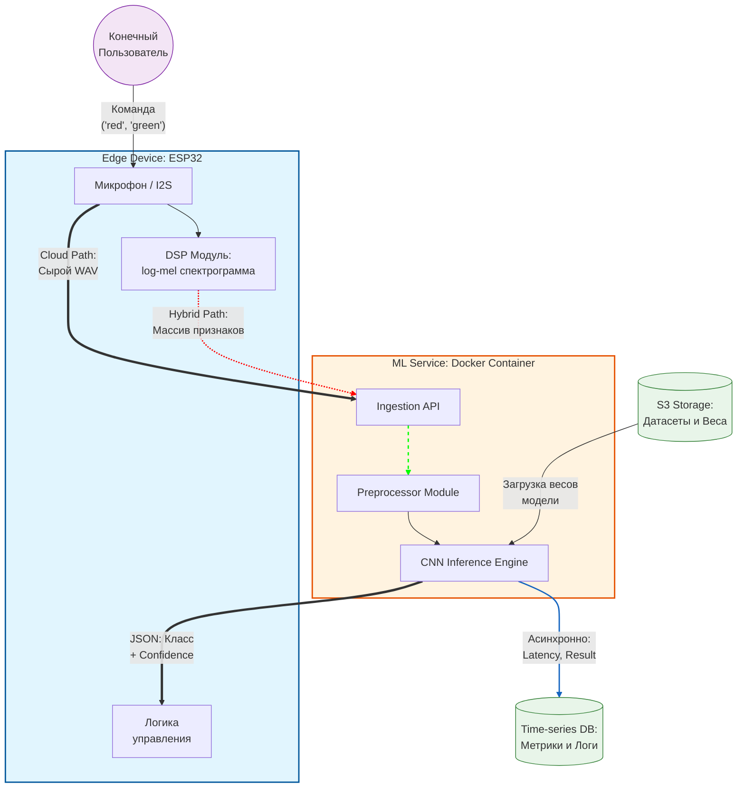
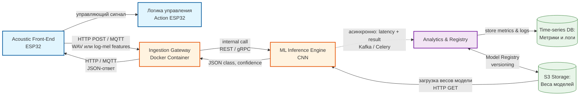

# Лабораторная работа №1: Постановка задачи и высокоуровневое проектирование

**ФИО:** Алимбеков Рауль Азатович
**Группа:** БВТ2201
**Тема:** Проектирование ML-сервиса классификации звуковых событий

---

## Шаг 1. Выбор темы

**Тема проекта:** "Разработка гибридного ML-сервиса для классификации акустических событий в реальном времени с поддержкой Edge-вычислений"

**Цель:** Создать масштабируемый сервис, способный принимать аудиоданные от микроконтроллеров (например, ESP32), выполнять их классификацию (распознавание команд: "red", "green" и т.д.), а также служить платформой для сравнения подходов облачных вычислений и гибридного метода, при котором предобработка данных осуществляется на конечном устройстве (edge), а основная обработка — в облаке

---

## Шаг 2. Формулировка бизнес-задачи и ML-интерпретация

### 2.1 Какую проблему решает сервис?

Современные системы голосового управления IoT-устройствами сильно зависят от стабильности и пропускной способности интернет-канала. Сервис решает проблему задержек (latency) и избыточного расхода трафика путем переноса части вычислений (предобработки или инференса) на сторону микроконтроллера

### 2.2 Какую выгоду несёт сервис и кто её получит?

Выгода заключается в повышении отказоустойчивости системы, снижении времени отклика и экономии серверных ресурсов. Основные выгодоприобретатели — разработчики встраиваемых систем, производители умного дома и конечные пользователи IoT-устройств

### 2.3 Зачем тут ML? Какая его функция?

Классические алгоритмические методы обработки звука не способны надежно выделять конкретные слова (Keyword Spotting) в условиях фонового шума и разного произношения. Функция ML (например, легковесной CNN) — находить паттерны, соответствующие комнадам, на спектрограммах аудиосигналов.

### 2.4 Входные и выходные данные

**Входные данные:** Сырой аудиопоток (WAV/PCM, 16 кГц) ИЛИ уже извлеченные на устройстве признаки (например, log-mel спектрограммы).

**Выходные данные**: JSON-объект с результатами:

---

## Шаг 3. Определение метрик качества

### 3.1 Бизнес-метрики

**End-to-end Latency (Время отклика):** Время от произнесения команды до получения управляющего сигнала. Качество модели (ее размер и скорость) напрямую влияет на эту метрику: слишком тяжелая модель не запустится на ESP32, а передача сырого аудио в облако увеличит задержку сети.

**Network Bandwidth Saved (Экономия трафика)**: Разница в байтах между отправкой сырого аудио и отправкой только извлеченных фичей / готового JSON-ответа.

### 3.2 ML-метрики

**F1-Score (макро):** Важно соблюдать баланс между Precision (чтобы устройство не реагировало ложно) и Recall (чтобы не игнорировало пользователя). Это напрямую влияет на User Experience (UX).
**Inference Time (ms) & Memory Footprint (KB):** Специфичные метрики для Edge-устройств. Жестко ограничивают выбор архитектуры нейросети.

---

## Шаг 4. Источник данных и EDA

**Источник:** Открытый датасет [Google Speech Commands Dataset](https://www.kaggle.com/datasets/neehakurelli/google-speech-commands) (содержит записи слов "red", "green", "blue" и др.) или собственный собранный датасет команд.

**План разведочного анализа (EDA):**
  1. Оценка баланса классов (количества записей для каждой команды).
  2. Анализ распределения длительности аудиозаписей (обрезка/паддинг до 1 секунды)
  3. Построение и визуализация log-mel спектрограмм для разных слов с целью визуальной оценки разделимости классов.
  4. Анализ уровня фонового шума.

---

## Шаг 5. Проектирование высокоуровневой архитектуры системы
### 5.1 Контекстная диаграмма

### 5.2 Описание основных потоков данных

**Система в центре:**

 - **Гибридный ML-сервис классификации аудио:** Ядро системы, упакованное в Docker-контейнер, отвечающее за прием аудиоданных, предобработку и инференс сверточной нейросети (CNN).

**Внешние пользователи (акторы):**

 - **Конечный пользователь:** Человек, произносящий голосовые команды (например, "red", "green") в зоне действия микрофона.

 - **Администратор / ML-инженер:** Специалист, который осуществляет мониторинг метрик производительности системы и деплой новых весов модели.

**Внешние системы, с которыми взаимодействует сервис:**

 - **Хранилище объектов (например, S3):** Используется для хранения обучающих датасетов и версионированных весов моделей.

 - **База данных временных рядов (Time-series DB):** Внешняя система для сохранения логов, метрик задержки (latency) и результатов работы для последующей аналитики.

**Основные потоки данных:**

 - **Как пользователь взаимодействует с системой:** Пользователь произносит команду. Микроконтроллер (ESP32) захватывает звук и, в зависимости от режима, либо отправляет сырой аудиопоток, либо предварительно извлекает спектрограмму и отправляет её по сети на API сервиса. Устройство получает в ответ команду на действие (JSON).

 - **Откуда поступают данные для обучения / инференса:** Данные для обучения и веса модели подтягиваются ML-сервисом из объектного хранилища (S3) при старте или обновлении. Данные для инференса поступают непрерывным потоком (HTTP/MQTT) напрямую с Edge-устройств.

 - **Куда сохраняются результаты:** Возвращенный JSON с предсказанным классом и уверенностью (confidence) используется на самом ESP32 для выполнения действия (например, переключения светодиода). Метаданные о запросе (время отклика, выбранный режим обработки, результат) асинхронно сохраняются в Time-series DB.

--- 

 ## Шаг 6. Выделение модулей и протоколов взаимодействия

 ### 6.1 Основные модули и их ответственность

| Модуль                    | Расположение        | Ответственность (Responsibility)                                                                 |
|--------------------------|---------------------|--------------------------------------------------------------------------------------------------|
| Acoustic Front-End (AFE) | Edge (ESP32)        | Захват аудио с микрофона (I2S), нормализация, опциональное извлечение признаков (STFT/Log-Mel) и упаковка данных для отправки. |
| Ingestion Gateway        | Cloud (Docker)      | Прием входящих запросов, валидация формата (WAV или массив фичей), аутентификация устройства и маршрутизация к ML-движку.     |
| ML Inference Engine      | Cloud (Docker)      | Загрузка весов CNN-модели, выполнение инференса (классификация команд) и формирование JSON-ответа с вероятностями классов.     |
| Analytics & Registry     | Cloud / External    | Хранение истории запросов, логирование задержек и версионирование моделей (Model Registry).                                    |

### 6.2 Протоколы взаимодействия между модулями

**Основные протоколы и форматы обмена данными:**

- **Acoustic Front-End (AFE) ↔ Ingestion Gateway**  
  Протокол: **HTTP POST** (REST) или **MQTT Publish/Subscribe** (рекомендуется для реального времени и низкой задержки).  
  Формат данных: JSON-объект, содержащий либо base64-encoded сырой WAV/PCM (16 кГц), либо уже извлечённый массив log-mel спектрограммы (float32, shape ≈ [1, 128, 32]).  
  Аутентификация: JWT-токен или API-key в заголовках.

- **Ingestion Gateway ↔ ML Inference Engine**  
  Протокол: **внутренний вызов** внутри одного Docker-контейнера (Python-функция или внутренний FastAPI/gRPC-эндпоинт).  
  Формат: Python dict / NumPy-массив признаков + метаданные устройства.

- **ML Inference Engine ↔ Analytics & Registry**  
  Протокол: **асинхронный** (Celery task / Kafka / прямой клиент БД).  
  Формат: JSON с метриками (latency, confidence, выбранный режим — cloud/hybrid, device_id).

- **ML Inference Engine ↔ S3 Storage**  
  Протокол: **HTTP GET** (AWS SDK / boto3).  
  Выполняется при старте контейнера или при обновлении версии модели (Model Registry).

- **Analytics & Registry ↔ Time-series DB**  
  Протокол: **прямое подключение** (InfluxDB client / TimescaleDB / Prometheus remote write).  
  Формат: временные ряды метрик + логи предсказаний.

- **Ingestion Gateway ↔ ESP32 (ответ)**  
  Тот же протокол, что и входящий запрос (HTTP Response / MQTT).  
  Формат ответа: компактный JSON `{ "predicted_class": "red", "confidence": 0.94, "latency_ms": 45 }`.

Все протоколы выбраны с учётом ограничений Edge-устройства (малый размер пакетов, низкое энергопотребление) и требований реального времени (latency < 200 мс end-to-end).

## 6.3 Диаграмма взаимодействия модулей

## Шаг 7. Предварительный выбор технологий и их обоснование

### 7.1 Edge Device Firmware (ESP32)
**Выбрано:** ESP-IDF (C/C++) + ESP-DSP библиотека + PlatformIO

**Почему ESP-IDF + ESP-DSP:**  
Нативная производительность и минимальное потребление памяти/энергии на микроконтроллере. Прямая работа с I2S-интерфейсом микрофона, встроенные функции FFT и фильтров для быстрого извлечения log-mel спектрограммы прямо на устройстве (гибридный режим). PlatformIO упрощает сборку и отладку.

**Почему не Arduino Framework:**  
Большие overhead по памяти и скорости, не подходит для реального времени и жёстких ограничений ESP32 (Inference Time + Memory Footprint).  
**Почему не MicroPython:**  
Слишком медленный интерпретатор для DSP-операций и реального времени (latency > 200 мс).  
**Почему не TensorFlow Lite Micro (на данном этапе):**  
Полный инференс CNN на ESP32 будет рассмотрен позже как опциональный режим; сейчас достаточно только предобработки признаков.

### 7.2 Ingestion Gateway (приём данных от Edge)
**Выбрано:** FastAPI (Python 3.11) + Uvicorn + Pydantic v2

**Почему FastAPI:**  
Высокая производительность (async/await + Starlette), автоматическая валидация и документация OpenAPI, удобная обработка больших бинарных данных (WAV или numpy-массивов спектрограмм). Поддержка как HTTP POST, так и интеграция с MQTT через отдельный клиент.

**Почему не Flask:**  
Отсутствует встроенная асинхронность, валидация и автодокументация — требуется больше boilerplate-кода.  
**Почему не Django/NestJS:**  
Избыточны для микросервисного API, замедляют разработку и увеличивают размер Docker-образа.  
**Почему не Node.js + Express:**  
Python значительно удобнее для дальнейшей интеграции с ML-фреймворками (PyTorch/torchaudio).

### 7.3 ML Inference Engine (классификация CNN)
**Выбрано:** PyTorch 2.x + torchaudio + ONNX Runtime (для инференса)

**Почему PyTorch + torchaudio:**  
Идеально подходит для работы со спектрограммами (лёгкое построение лёгковесной CNN: Conv2D + pooling). Гибкий динамический граф, удобные инструменты для аудио (MelSpectrogram, MFCC), отличная экосистема для обучения на Google Speech Commands. ONNX Runtime обеспечивает максимально быстрый инференс и возможность экспорта модели для Edge (TFLite/ONNX).

**Почему не scikit-learn:**  
Не предназначен для работы с 2D-спектрограммами и свёрточными сетями (только классические алгоритмы на табличных данных).  
**Почему не TensorFlow/Keras (основной вариант):**  
PyTorch более pythonic и удобен для исследовательских экспериментов с архитектурами CNN; TF выбран бы только если нужен прямой TFLite-экспорт на ESP32 в будущем.  
**Почему не чистый TensorFlow Lite в облаке:**  
В облаке нужна максимальная скорость разработки и отладки модели — TFLite используется только для финального деплоя.

### 7.4 Хранилище моделей и датасетов
**Выбрано:** Amazon S3 (или совместимый MinIO в Docker)

**Почему S3/MinIO:**  
Простое версионирование весов моделей (Model Registry), надёжное хранение больших датасетов (Google Speech Commands) и артефактов обучения. Легко интегрируется с boto3 и PyTorch (torch.hub.load).

**Почему не локальная файловая система:**  
Отсутствует версионирование, резервное копирование и масштабируемость при нескольких инстансах сервиса.  
**Почему не PostgreSQL (для моделей):**  
Бинарные веса CNN (десятки МБ) плохо подходят для реляционной БД.

### 7.5 Analytics & Time-series DB (метрики и логи)
**Выбрано:** TimescaleDB (расширение PostgreSQL) или InfluxDB 2.x

**Почему TimescaleDB/InfluxDB:**  
Специализированная оптимизация под временные ряды (latency, confidence, network bandwidth, inference time). Высокая скорость записи и запросов для дашбордов мониторинга. Поддержка retention policy и автоматического downsampling.

**Почему не обычный PostgreSQL:**  
Хуже справляется с миллионами записей метрик в секунду (необходимы hypertables).  
**Почему не MongoDB:**  
Слабая поддержка агрегаций по времени и более высокое потребление памяти для time-series.

### 7.6 Контейнеризация и оркестрация
**Выбрано:** Docker + docker-compose (для разработки и тестирования)

**Почему Docker:**  
Полная изоляция сервисов (Gateway + ML Engine), воспроизводимость окружения, лёгкое управление зависимостями PyTorch/CUDA (при необходимости GPU-инференса).

**Почему docker-compose:**  
Простая оркестрация всех контейнеров (API + DB + MinIO) в одном `docker-compose.yml` — идеально для лабораторной и локального тестирования.  

**Почему не Kubernetes:**  
Избыточная сложность и overhead для учебного проекта и небольшого количества Edge-устройств.  
**Почему не чистый systemd:**  
Отсутствует изоляция, portability и удобство обновления моделей.

---

**Общий стек проекта полностью соответствует требованиям гибридной архитектуры:** минимальный footprint на ESP32, максимальная скорость и масштабируемость в облаке, возможность прямого сравнения Cloud-only vs Hybrid режимов по latency и трафику.

