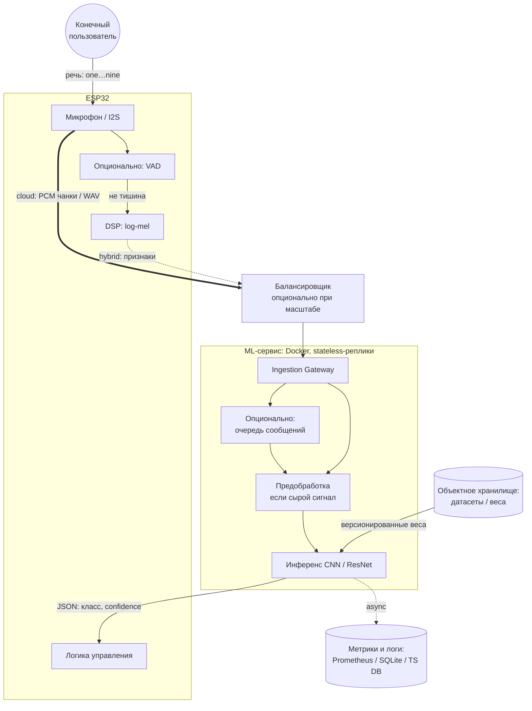

# Лабораторная работа №2: Корректировка архитектуры системы на основе стратегии валидации, воспроизводимости, масштабируемости

**ФИО:** Алимбеков Рауль Азатович  
**Группа:** БВТ2201  
**Тема проекта:** Разработка гибридного ML-сервиса для распознавания в реальном времени чисел на английском («one»–«nine») с поддержкой Edge-вычислений.

---

## Шаг 1. Стратегия валидации и воспроизводимость

### Стратегия валидации

**Природа данных.** Обучение и оценка качества строятся на **Google Speech Commands** через `torchaudio.datasets.SPEECHCOMMANDS`: это набор коротких (~1 с, 16 кГц) нарезок с чёткой меткой класса. В проекте целевые классы — **английские числительные «one»–«nine»** плюс служебные **«silence»** и **«unknown»** (отбор примеров для последних двух выполняется по правилам из ЛР3 с фиксированными зернами ГСЧ, чтобы воспроизводить состав обучающей выборки).

**Разбиение.** Используются **официальные подмножества** `training`, `validation` и `testing`, поставляемые вместе с датасетом. Они **не пересекаются по говорящим** (speaker-disjoint): все записи одного спикера попадают ровно в один сплит. Для KWS это важно, потому что иначе модель может опираться на индивидуальные особенности голоса и микрофона, а целевой сценарий — **новые пользователи и другое железо (ESP32)**, то есть распределение по спикерам ближе к внешней среде, чем случайное разбиение файлов.

**Роли сплитов.** На **validation** настраивают модель и сравнивают варианты (в ЛР3 — в том числе по **macro F1**). **Test** используют для **однократной** итоговой оценки после выбора архитектуры и гиперпараметров, чтобы не занижать честную оценку на будущих данных. При финальном экспортe артефакта допускается схема **дообучения на объединении train+val** с последующей проверкой на test (как в ноутбуке ЛР3): это нужно зафиксировать в описании эксперимента, чтобы сравнение между запусками оставалось корректным.

**Метрики.** Основная ML-метрика при несимметричном числе примеров по классам — **macro F1** (равный вес классов). Дополнительно полезны accuracy и отчёт по классам (precision/recall).

---

### Воспроизводимость экспериментов: что версионировать

| Компонент | Что фиксировать | Зачем |
|-----------|-----------------|--------|
| **Исходный код** | Коммит Git (репозиторий: `app/`, `models/`, ноутбук ЛР3, Docker-файлы) | Один и тот же алгоритм обучения и предобработки |
| **Окружение** | `requirements.txt` (и при необходимости полный lock), версия базового образа в `Dockerfile.inference` / `Dockerfile.ui` | Совпадение версий PyTorch, torchaudio, librosa и др. |
| **Данные** | Каталог датасета (например `data/SpeechCommands`), версия **torchaudio** и способ загрузки `SPEECHCOMMANDS`; при изменении состава `unknown`/`silence` — те же **seed**, что в ноутбуке | Одинаковый состав train/val/test |
| **Конфигурация обучения** | Зафиксированные в ноутбуке/скрипте: `SEED`, число эпох, learning rate, batch size, состав классов, параметры Mel (`n_fft`, `hop_length`, `n_mels`, `sample_rate`) | Повторяемые прогоны и сравнимые эксперименты |
| **Артефакт модели** | Файл чекпоинта (например `artifacts/kws_resnet.pt`): `state_dict`, список **`labels`**, параметры фронтенда в чекпоинте (`sample_rate`, `n_mels`, …) | Совпадение инференса с обучением; трассировка «какая модель в проде» |
| **Сервис** | Переменная/имя файла модели при запуске API, образ Docker с тегом или дайджестом | Воспроизводимость развёртывания |

**Итог.** Валидация опирается на **официальные speaker-disjoint сплиты** и **macro F1** с финальной проверкой на **test**; воспроизводимость обеспечивается связкой **Git + зафиксированные зависимости + датасет и сиды + чекпоинт с метаданными**.

---

## Шаг 2. Анализ утечек данных

Для задачи **классификации коротких записей по заранее размеченным классам** при использовании **официальных** сплитов Speech Commands утечки **маловероятны**, если не смешивать train/validation/test в одном пайплайне: нет скользящего окна по одному длинному сигналу и нет ручной разметки, зависящей от целевой переменной на отложенной выборке.

| Риск | Суть | Предотвращение |
|------|------|----------------|
| **Утечка по говорящему** | Модель подстраивается под конкретных дикторов; метрика на val/test завышена. | Разбиение **только по speaker_id**; использование поставляемых с датасетом сплитов, если они так устроены. |
| **Глобальная нормализация** | Оценка mean/variance (или иных статистик) по объединению train+val+test переносит информацию из теста в признаки. | Статистики — **только с train**; либо нормализация **локально по окну/батчу**, что не требует знания распределения теста. |
| **Повторный подбор по test** | Исследователь итеративно меняет модель, ориентируясь на test — утечка через человека. | Все решения — по **validation**; test — по заранее зафиксированному сценарию. |
| **Случайный отбор вспомогательных классов** | Один и тот же файл или спикер может непреднамеренно попасть и в train, и в контроль, если сэмплирование «сквозное». | Субдискретизация **внутри каждого сплита** с фиксированными seed и проверкой пересечений идентификаторов. |

**Вывод.** При соблюдении протокола сплитов и предобработки **существенных утечек в данные не ожидается**.

---

## Шаг 3. Масштабирование

### Оценка нагрузки (ориентир для пилота IoT / KWS с ESP32)

Нагрузку удобно разделять на два режима: **дискретные запросы** (отправка готового фрагмента аудио после окончания фразы или по кнопке) и **потоковую** (скользящее окно: на сервер периодически приходят короткие чанки одного и того же сеанса).

| Показатель | Среднее (оценка) | Пик (оценка) | Комментарий |
|------------|------------------|--------------|-------------|
| **RPS** | **10²–10³** инференсов/с | **10³–10⁴** инференсов/с | В дискретном режиме RPS близок к числу **завершённых обращений к API в секунду** (сотни устройств × редкие команды). В потоковом — к числу **классификаций окон в секунду** по всем активным сессиям (каждое устройство даёт несколько запросов в секунду из‑за шага окна). |
| **Трафик (вход)** | порядка **10² Мбит/с** | **до ~0,5 Гбит/с** | При **сыром PCM 16 кГц, 16 бит, моно** ~**256 кбит/с** на одно устройство; при **N ≈ 500–2000** одновременных полных стримов суммарно **~0,13–0,5 Гбит/с**. Если устройства шлют данные не непрерывно, среднее ниже. В **гибридном** режиме (log-mel на ESP32) — на порядок меньше байт на шаг. |
| **Latency** | целевой **инференс на сервере: десятки миллисекунд** | **сквозная (end-to-end): сотни миллисекунд** | Пользователю важна задержка **от конца произнесения цифры до ответа устройству**; в бюджет входят сеть, очередь, инференс и обратный канал. Разумный ориентир для голосового UI: **≤ 300–500 мс** сквозняком при стабильной сети. |

Цифры зависят от числа устройств, доли одновременно говорящих и шага скользящего окна; в отчёте они заданы как **порядок величин** для обоснования архитектуры, а не как гарантия без измерений.

### Как масштабировать систему при росте нагрузки

1. **Горизонтальное масштабирование инференса.** Сервис предсказаний делают **stateless**: модель и веса только для чтения, сеанс не привязан к конкретной реплике. За балансировщиком (например L7 или gRPC‑балансировщик в Kubernetes) разворачивают **несколько подов** с одним и тем же образом; при росте RPS или загрузки CPU/GPU увеличивают **число реплик** (HPA по CPU, длине очереди или латентности). Так линейно растёт пропускная способность до предела БД/шины.

2. **Синхронный vs асинхронный путь.** Для **низкой задержки** удобен **синхронный** ответ: запрос с признаками или WAV → сразу JSON с классом. Если пики перегружают сервер, вводят **очередь** (Redis Streams, Kafka, NATS): шлюз кладёт задачу, воркеры батчат инференс на GPU; клиент либо ждёт по **долгоживущему соединению** с push‑ответом, либо опрашивает результат. Для KWS в реальном времени обычно **смешанная** схема: критичный путь остаётся синхронным внутри реплики, а **логирование и метрики** — асинхронно.

3. **Кэширование.** Полноценный кэш ответов по аудио на KWS **редко эффективен** (входы почти не повторяются). Имеет смысл кэшировать **вспомогательные данные** (конфигурация модели, справочники классов) и применять **батчинг** на GPU вместо кэша. Если на edge уже приходит дискретная команда редко, можно кэшировать **идемпотентные** ответы по `request_id`, но это не основной рычаг.

4. **Снижение нагрузки до масштабирования.** **Предобработка на ESP32** уменьшает входной трафик и время передачи; **VAD на устройстве** — не слать тишину на сервер; **рефракторный период** после срабатывания — не дублировать инференс на каждом шаге окна без необходимости.

**Обоснование выбора комбинации.** Для задачи **множества слабых клиентов и серверного KWS** естественна связка: **stateless горизонтальное масштабирование** + по возможности **гибридный вход** (меньше трафика и стабильнее latency) + при всплесках **очередь и воркеры** без блокировки всего шлюза. Так система переносит рост **RPS и суммарного трафика** без переписывания модели.

---

## Шаг 4. Корректировка архитектурной документации (шаги 5–7 ЛР1)

Ниже — **что именно следует изменить** в `docs/lab1.md` в шагах 5–7, чтобы они согласовались с решениями шагов 1–3 настоящей работы (валидация и версионирование, утечки, масштабирование) и с уточнённой темой (**числа «one»–«nine»**, **основной клиент — ESP32**, не браузер).

### 4.1 Шаг 5 ЛР1 — высокоуровневая архитектура

| Было в ЛР1 | Предлагаемая корректировка |
|------------|----------------------------|
| Примеры команд **«red», «green»** | Заменить на целевые классы **«one»–«nine»** (+ при необходимости `silence` / `unknown` в описании потока). |
| Поток с ESP32 описан общо; акцент на **HTTP/MQTT** | Явно разделить **дискретный** путь (готовый WAV/чанк, REST) и **потоковый** KWS (скользящее окно: **WebSocket** или **gRPC streaming** / долгий MQTT-сессия с серией чанков). |
| Один контейнер «ML Service» без масштабирования | На схеме и в тексте добавить **балансировщик нагрузки** перед приёмом трафика и указать, что реплики **stateless** (шаг 3); при росте нагрузки — **опциональная очередь** (Redis/Kafka) между шлюзом и воркерами инференса. |
| Нет связи с воспроизводимостью | В блок про внешние системы или потоки деплоя добавить: **версия артефакта модели** (чекпоинт + метаданные), **Git/фиксация зависимостей** — без привязки обучения только к «магическому» S3. |
| Рис. 5.1 | Дополнить узлы **LB**, при необходимости **Stream Gateway** / очередь; обозначить **два канала** от ESP32: сырой PCM и гибрид (признаки). |

**Обновлённая контекстная диаграмма (замена фрагмента 5.1)** — логика для вставки в ЛР1:

Текст **п. 5.2**: уточнить, что **браузер / Streamlit** — вспомогательный канал для разработки и демо; **продуктивный источник** — ESP32. Целевую **end-to-end latency** согласовать с шагом 3 (**~300–500 мс**), а не жёстко «менее 200 мс» без обоснования.

---

### 4.2 Шаг 6 ЛР1 — модули и протоколы

| Было | Корректировка |
|------|----------------|
| Только **HTTP POST / MQTT** для AFE ↔ Gateway | Добавить **WebSocket** (или gRPC bidirectional) для **потока чанков**; REST оставить для **однократной** подачи WAV/base64. |
| Gateway ↔ ML — только внутренний вызов | Для масштабирования (шаг 3): описать вариант **очередь + воркеры** между шлюзом и инференсом; при малых нагрузках — по-прежнему in-process вызов. |
| Один блок **Analytics & Registry** + **Time-series DB** | Зафиксировать **реалистичный минимум**: экспорт метрик **Prometheus**, лог запросов в **SQLite** (или иной лёгкий store); TimescaleDB/Influx — как **целевое** развитие, не как единственный обязательный компонент лабораторного контура. |
| Пример JSON с `"red"` | Заменить на **`"one"` … `"nine"`** и поля `latency_ms`, `model_version` для трассировки (связь с шагом 1). |
| Диаграмма 6.3 | Добавить **LB**, **двойной вход** (REST / stream), пунктир **очереди** и **async → метрики/логи**. |

В таблице **6.1** в колонке ответственности **Ingestion Gateway** дополнить: мультиплексирование **REST + поток**, ограничение размера чанков, привязка сессии к `device_id` (при появлении в протоколе).

---

### 4.3 Шаг 7 ЛР1 — стек технологий

| Раздел ЛР1 | Корректировка |
|------------|----------------|
| **7.2 Gateway** | Явно: **FastAPI + Uvicorn**; добавить **WebSocket** (и при желании `starlette`/`python-multipart` для файлов); MQTT — опционально для embedded. |
| **7.3 Inference** | Согласовать с фактической моделью: **PyTorch + torchaudio** (Mel-фронтенд), архитектура **CNN или ResNet**; **ONNX Runtime** — опциональный путь ускорения, не обязательный для текущего контура. |
| **7.4 Хранилище** | Оставить S3/MinIO как вариант для **артефактов и датасетов**; для воспроизводимости (шаг 1) подчеркнуть **версию файла чекпоинта в образе/volume** и **Git**. |
| **7.5 Метрики** | Добавить **Prometheus** + **Grafana** как типовой стек наблюдаемости; TSDB — для зрелой эксплуатации. |
| **7.6 Контейнеризация** | Уточнить **отдельные образы** API и UI (**docker compose**), **healthcheck**; для прод — намёк на **Kubernetes** при горизонтальном масштабировании (шаг 3). |

**Итог шага 4.** Документ ЛР1 после правок отражает **потоковый KWS**, **масштабирование репликами и очередью**, **согласованные SLA по задержке**, **метрики и версии модели**, а также **актуальную предметную область** (распознавание чисел и сценарий ESP32).
