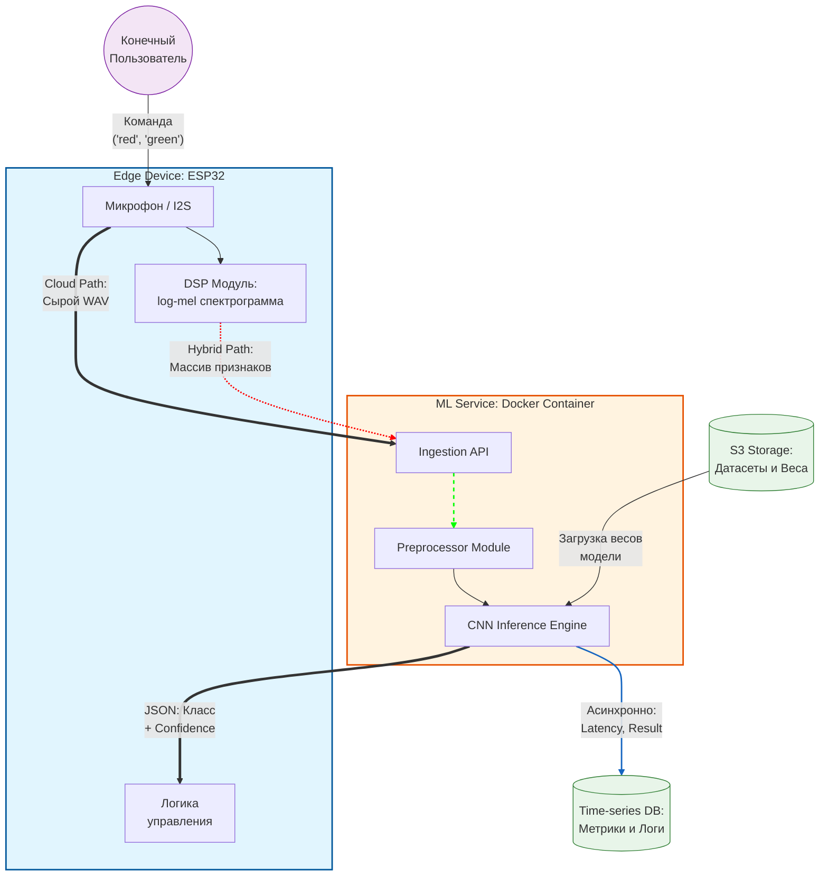

# Лабораторная работа №1: Постановка задачи и высокоуровневое проектирование

**ФИО:** Алимбеков Рауль Азатович
**Группа:** БВТ2201
**Тема:** Проектирование ML-сервиса классификации звуковых событий

---

## Шаг 1. Выбор темы

**Тема проекта:** "Разработка гибридного ML-сервиса для классификации акустических событий в реальном времени с поддержкой Edge-вычислений"

**Цель:** Создать масштабируемый сервис, способный принимать аудиоданные от микроконтроллеров (например, ESP32), выполнять их классификацию (распознавание названий цветов: "red", "green" и т.д.), а также служить платформой для сравнения подходов облачных вычислений и гибридного метода, при котором предобработка данных осуществляется на конечном устройстве (edge), а основная обработка — в облаке

---

## Шаг 2. Формулировка бизнес-задачи и ML-интерпретация

### 2.1 Какую проблему решает сервис?

Современные системы голосового управления IoT-устройствами сильно зависят от стабильности и пропускной способности интернет-канала. Сервис решает проблему задержек (latency) и избыточного расхода трафика путем переноса части вычислений (предобработки или инференса) на сторону микроконтроллера

### 2.2 Какую выгоду несёт сервис и кто её получит?

Выгода заключается в повышении отказоустойчивости системы, снижении времени отклика и экономии серверных ресурсов. Основные выгодоприобретатели — разработчики встраиваемых систем, производители умного дома и конечные пользователи IoT-устройств

### 2.3 Зачем тут ML? Какая его функция?

Классические алгоритмические методы обработки звука не способны надежно выделять конкретные слова (Keyword Spotting) в условиях фонового шума и разного произношения. Функция ML (например, легковесной CNN) — находить паттерны, соответствующие названиям цветов, на спектрограммах аудиосигналов.

### 2.4 Входные и выходные данные

**Входные данные:** Сырой аудиопоток (WAV/PCM, 16 кГц) ИЛИ уже извлеченные на устройстве признаки (например, log-mel спектрограммы).

**Выходные данные**: JSON-объект с результатами:

---

## Шаг 3. Определение метрик качества

### 3.1 Бизнес-метрики

**End-to-end Latency (Время отклика):** Время от произнесения команды до получения управляющего сигнала. Качество модели (ее размер и скорость) напрямую влияет на эту метрику: слишком тяжелая модель не запустится на ESP32, а передача сырого аудио в облако увеличит задержку сети.

**Network Bandwidth Saved (Экономия трафика)**: Разница в байтах между отправкой сырого аудио и отправкой только извлеченных фичей / готового JSON-ответа.

### 3.2 ML-метрики

**F1-Score (макро):** Важно соблюдать баланс между Precision (чтобы устройство не реагировало ложно) и Recall (чтобы не игнорировало пользователя). Это напрямую влияет на User Experience (UX).
**Inference Time (ms) & Memory Footprint (KB):** Специфичные метрики для Edge-устройств. Жестко ограничивают выбор архитектуры нейросети.

---

## Шаг 4. Источник данных и EDA

**Источник:** Открытый датасет [Google Speech Commands Dataset](https://www.kaggle.com/datasets/neehakurelli/google-speech-commands) (содержит записи слов "red", "green", "blue" и др.) или собственный собранный датасет команд.

**План разведочного анализа (EDA):**
  1. Оценка баланса классов (количества записей для каждого цвета).
  2. Анализ распределения длительности аудиозаписей (обрезка/паддинг до 1 секунды)
  3. Построение и визуализация log-mel спектрограмм для разных слов с целью визуальной оценки разделимости классов.
  4. Анализ уровня фонового шума.

---

## Шаг 5. Проектирование высокоуровневой архитектуры системы
### 5.1 Контекстная диаграмма

### 5.2 Описание основных потоков данных

**Система в центре:**

 - **Гибридный ML-сервис классификации аудио:** Ядро системы, упакованное в Docker-контейнер, отвечающее за прием аудиоданных, предобработку и инференс сверточной нейросети (CNN).

**Внешние пользователи (акторы):**

 - **Конечный пользователь:** Человек, произносящий голосовые команды (например, "red", "green") в зоне действия микрофона.

 - **Администратор / ML-инженер:** Специалист, который осуществляет мониторинг метрик производительности системы и деплой новых весов модели.

**Внешние системы, с которыми взаимодействует сервис:**

 - **Хранилище объектов (например, S3):** Используется для хранения обучающих датасетов и версионированных весов моделей.

 - **База данных временных рядов (Time-series DB):** Внешняя система для сохранения логов, метрик задержки (latency) и результатов работы для последующей аналитики.

**Основные потоки данных:**

 - **Как пользователь взаимодействует с системой:** Пользователь произносит команду. Микроконтроллер (ESP32) захватывает звук и, в зависимости от режима, либо отправляет сырой аудиопоток, либо предварительно извлекает спектрограмму и отправляет её по сети на API сервиса. Устройство получает в ответ команду на действие (JSON).

 - **Откуда поступают данные для обучения / инференса:** Данные для обучения и веса модели подтягиваются ML-сервисом из объектного хранилища (S3) при старте или обновлении. Данные для инференса поступают непрерывным потоком (HTTP/MQTT) напрямую с Edge-устройств.

 - **Куда сохраняются результаты:** Возвращенный JSON с предсказанным классом и уверенностью (confidence) используется на самом ESP32 для выполнения действия (например, переключения светодиода). Метаданные о запросе (время отклика, выбранный режим обработки, результат) асинхронно сохраняются в Time-series DB.

